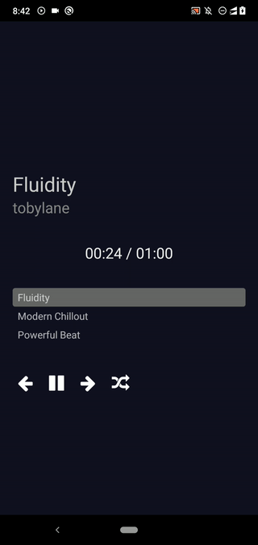

# CaesarAIMusicStream
A CaesarAIMusic song player

## Preview



## How to run the app?

- Download or clone the repository.
- Install dependencies:
```bash
npm install
# --- or ---
yarn install
```
- Run the app:
```bash
npx react-native run-android
# --- or ---
npx react-native run-ios
```

## Credits

Contains three royalty free music tracks from [Pixabay](https://pixabay.com/music/). Credit goes to original music track authors (Filenames contain Pixabay track identifiers).

## License

[MIT](LICENSE)

# Streaming Links
https://caesaraimusicstreamyt-662756251108.europe-west2.run.app

https://caesaraimusicstreamyt-qqbn26mgpa-nw.a.run.app/getaudio?url=${video_link}

# Get Youtube Link
https://caesaraiyoutube-qqbn26mgpa-uc.a.run.app/searchfeed?query=${searchquery}&amount=50`